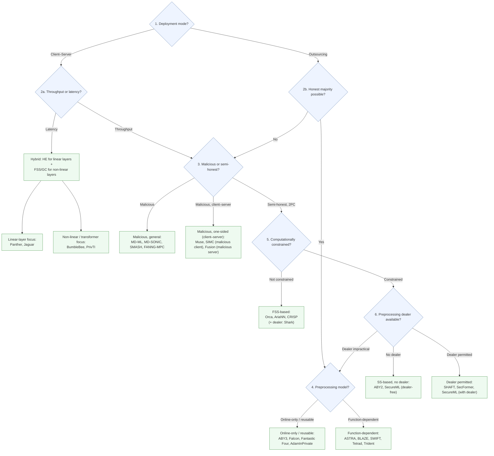

[← Back to README](../../README.md)

---

### Decision Graph — Choosing a PPML Framework

Our taxonomy classifies MPC-based PPML frameworks across five design dimensions: **algebraic structure**, **threat model**, **execution phase**, **deployment mode**, and **network setting** (see the [Comprehensive MPC Design table](../Systematization/systematization-mpc.md)). Those dimensions describe protocol properties, but they don't by themselves tell you where to start looking. This page is a heuristic decision graph — a series of high-level questions about your application's requirements that narrows down which region of the taxonomy is relevant, and points at representative frameworks in that region.

This is a **first-stage filter**, not a final answer: once you've narrowed down to a handful of candidates, you still need to check the number of parties, supported training/inference operations, arithmetic domain, model architecture, network topology, hardware availability, implementation maturity, and engineering effort — see the [Systematic Overview tables](../Systematization/systematization-mpc.md) and [Theoretical Cost tables](../Theoretical-analysis/theoretical-analysis-dot-product.md) for that level of detail.

---

#### At a glance

*(This is a hand-drawn summary of the branching logic below — for the full figure with exact styling, see the paper's own decision graph in Appendix C. The "Dealer impractical" branch loops back to step 4, since distributing the dealer's role among the computing parties leads back to the function-dependent, honest-majority designs.)*

---

#### 1. Is this a client–server or an outsourcing deployment?

- In a **client–server** deployment, the client supplies private input and the server provides a model or computational service.
- In an **outsourcing** deployment, multiple computing parties instead jointly evaluate the function over secret-shared inputs.

These imply different party roles and trust assumptions, so they're the first branch.

---

#### 2a. Client–server: is throughput or latency the priority?

Client–server frameworks commonly operate under a **dishonest-majority** assumption and target low-latency, single-query workloads.

- **Low latency is the priority** → typically a **hybrid** design: HE for linear layers (keeps round count low) combined with FSS or garbled circuits (rather than SS-based methods) for non-linear layers, trading extra communication for fewer rounds.
  - Frameworks focused on optimizing the **linear-layer** component: Panther [[146]](../../Bibliography/references.md#Panther/DBLP:journals/tifs/FengWSZL25), Jaguar [[262]](../../Bibliography/references.md#jeong2026jaguar)
  - Frameworks focused on the **non-linear** component (esp. transformers): BumbleBee [[213]](../../Bibliography/references.md#BumbleBee/DBLP:conf/ndss/LuHGL000WC25), PrivTI [[261]](../../Bibliography/references.md#luo2026privti)
- **Throughput is the priority** → continue to [step 3 (malicious vs. semi-honest)](#3-malicious-or-semi-honest).

---

#### 2b. Outsourcing: can the computing parties assume an honest majority?

- **Yes, honest majority** → continue to [step 4 (preprocessing model)](#4-honest-majority-which-preprocessing-model).
- **No** → continue to [step 3 (malicious vs. semi-honest)](#3-malicious-or-semi-honest).

---

#### 3. Malicious or semi-honest?

This question applies whenever an honest majority can't be assumed — either because the outsourcing parties lack that guarantee, or because a client–server deployment prioritized throughput over the low-latency hybrid design in step 2a.

- **Malicious dishonest-majority** frameworks commonly authenticate secret shares with MACs or related integrity mechanisms: MD-ML [[141]](../../Bibliography/references.md#md-ml/DBLP:conf/uss/YuanYZ0G024), MD-SONIC [[195]](../../Bibliography/references.md#MD-SONIC/DBLP:journals/tifs/ZhangCDZHLC25), SMASH [[260]](../../Bibliography/references.md#lv2026smash), FANNG-MPC [[242]](../../Bibliography/references.md#Fanng-MPC/DBLP:journals/tches/AarajAGMMPSSSSS25).
  - In the **client–server** setting specifically, some solutions provide **one-sided** malicious security instead: Muse [[24]](../../Bibliography/references.md#Muse/DBLP:conf/uss/LehmkuhlMSP21) and SIMC [[130]](../../Bibliography/references.md#Simc/DBLP:conf/uss/Chandran0OS22) protect against a malicious *client*, while Fusion [[145]](../../Bibliography/references.md#Fusion/DBLP:conf/ndss/Dong0L0TYCH23) is statistically secure against a malicious *server*.
- **Semi-honest, throughput-oriented 2PC** → continue to [step 5 (compute constraints)](#5-semi-honest-2pc-are-the-computing-parties-computationally-constrained).

---

#### 4. Honest majority: which preprocessing model?

- **Online-only, or reusable function-independent** preprocessing (generic preprocessed shares, not tied to a specific function — broadly applicable, but often higher online communication): ABY3 [[12]](../../Bibliography/references.md#ABY3/DBLP:conf/ccs/MohasselR18), Falcon [[20]](../../Bibliography/references.md#Falcon/DBLP:journals/popets/WaghTBKMR21), Fantastic Four [[46]](../../Bibliography/references.md#fantasticfour/DBLP:conf/uss/Dalskov0K21), AdamInPrivate [[192]](../../Bibliography/references.md#AdamInPrivate/DBLP:journals/popets/AttrapadungHIKM22)
- **Function-dependent** preprocessing (tailored to the target function — extra offline cost/storage for a faster online phase): ASTRA [[239]](../../Bibliography/references.md#astra/DBLP:conf/ccs/ChaudhariCPS19), BLAZE [[15]](../../Bibliography/references.md#BLAZE/DBLP:conf/ndss/PatraS20), SWIFT [[28]](../../Bibliography/references.md#swift/DBLP:conf/uss/KotiPPS21), Tetrad [[38]](../../Bibliography/references.md#tetrad/DBLP:conf/ndss/KotiPRS22), Trident [[29]](../../Bibliography/references.md#trident/DBLP:conf/ndss/ChaudhariRS20)

> The preprocessing model alone doesn't fix the security level — semi-honest, active, fair, and robust guarantees still need to be checked separately for each framework (see the [Comprehensive MPC Design table](../Systematization/systematization-mpc.md)).

---

#### 5. Semi-honest 2PC: are the computing parties computationally constrained?

- **Not compute-constrained** → FSS-based protocols are attractive despite high computational cost and large precomputed keys: Orca [[244]](../../Bibliography/references.md#Orca/DBLP:conf/sp/JawalkarGBCGS24), AriaNN [[68]](../../Bibliography/references.md#ariann/DBLP:journals/popets/RyffelTPB22), CRISP [[258]](../../Bibliography/references.md#CRISP/DBLP:conf/ndss/FangZG26).
  - When a **preprocessing dealer is additionally available**, FSS-based protocols can even support malicious security cost-effectively: Shark [[240]](../../Bibliography/references.md#Shark/DBLP:conf/sp/GuptaC0K025).
- **Compute-constrained** → FSS's online cost makes it unattractive regardless of dealer availability (a dealer only removes the preprocessing cost, not the cost of evaluating FSS keys online) → continue to [step 6 (dealer availability)](#6-compute-constrained-is-a-preprocessing-dealer-available).

---

#### 6. Compute-constrained: is a preprocessing dealer available?

- **No dealer** → SS-based protocols offer a lighter-weight alternative: simpler preprocessing, but more communication/rounds during the offline phase. ABY2 [[11]](../../Bibliography/references.md#ABY2/DBLP:conf/uss/Patra0SY21), and the dealer-free variant of SecureML [[25]](../../Bibliography/references.md#SecureML/DBLP:conf/sp/MohasselZ17).
- **Trusted dealer permitted** → correlated randomness can be precomputed to speed up execution: SHAFT [[222]](../../Bibliography/references.md#SHAFT/DBLP:conf/ndss/KeiC25), SecFormer [[214]](../../Bibliography/references.md#SecFormer/DBLP:conf/acl/LuoZZZMW0X24). SecureML's two-party variant [[25]](../../Bibliography/references.md#SecureML/DBLP:conf/sp/MohasselZ17) can equally be instantiated with a dealer to generate Beaver triples.
- **Dealer not permitted, and preprocessing overhead is impractical** → the dealer's role can instead be distributed among the computing parties rather than delegated to a single trusted third party (this loops back toward the function-dependent, honest-majority designs in [step 4](#4-honest-majority-which-preprocessing-model)).

---

### A note on scope

No single procedure can select the right framework for every application — this decision graph is a first-stage filter. The final choice must still account for the number of parties, the supported training or inference operations, the arithmetic domain, model architecture, network topology, hardware availability, implementation maturity, engineering effort, and operational cost.

---

## Related Tables & Navigation

**Framework & Design Overviews:**
- [Comprehensive MPC Design](../Systematization/systematization-mpc.md)
- [2PC Frameworks](../Systematization/systematization-overview-2pc.md)
- [3/4PC Frameworks](../Systematization/systematization-overview-34pc.md)
- [N-Party Frameworks](../Systematization/systematization-overview-npc.md)

**Theoretical Costs Analysis:**
- [Dot-Product Costs](../Theoretical-analysis/theoretical-analysis-dot-product.md)
- [Truncation Costs](../Theoretical-analysis/theoretical-analysis-truncation.md)

**Reference Materials:**
- [Notation & Abbreviations](../notation.md)
- [← Back to README](../../README.md)
