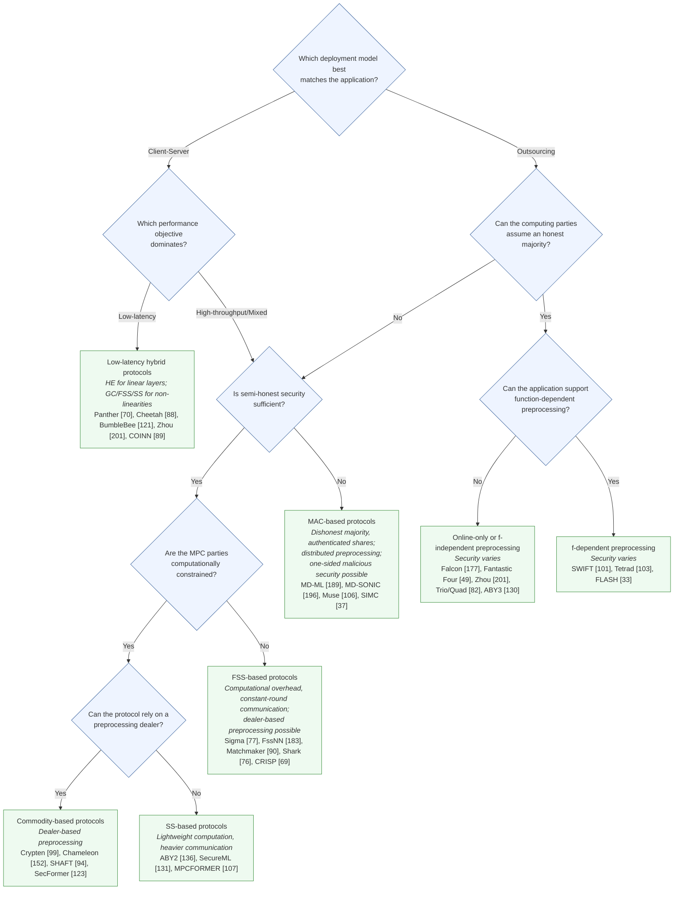

[← Back to README](../../README.md)

---

### Decision Graph — Choosing a PPML Framework

Our taxonomy classifies MPC-based PPML frameworks across five design dimensions: **algebraic structure**, **threat model**, **execution phase**, **deployment mode**, and **network setting** (see the [Comprehensive MPC Design table](../Systematization/systematization-mpc.md)). Those dimensions describe protocol properties, but they don't by themselves tell you where to start looking. This page is a heuristic decision graph — a series of high-level questions about your application's requirements that narrows down which region of the taxonomy is relevant, and points at representative frameworks in that region.

This is a **first-stage filter**, not a final answer: once you've narrowed down to a handful of candidates, you still need to check the number of parties, supported training/inference operations, arithmetic domain, model architecture, network topology, hardware availability, implementation maturity, and engineering effort — see the [Systematic Overview tables](../Systematization/systematization-mpc.md) and [Theoretical Cost tables](../Theoretical-analysis/theoretical-analysis-dot-product.md) for that level of detail.

---

#### At a glance

This mirrors the paper's Figure ("Heuristic decision graph for narrowing the choice of an MPC-based PPML framework"), using the same questions, the same edge labels, and the same representative (non-exhaustive) frameworks per leaf.

*Leaf nodes show representative, non-exhaustive protocol families and frameworks. The final choice must additionally account for the party count, supported ML functionality, arithmetic domain, network and hardware characteristics, and implementation maturity — see below.*

---

#### 1. Which deployment model best matches the application?

- In a **Client-Server** deployment, the client supplies private input and the server provides a model or computational service → continue to [2. Which performance objective dominates?](#2-which-performance-objective-dominates)
- In an **Outsourcing** deployment, multiple computing parties instead jointly evaluate the function over secret-shared inputs → continue to [3. Can the computing parties assume an honest majority?](#3-can-the-computing-parties-assume-an-honest-majority)

---

#### 2. Which performance objective dominates?

- **Low-latency** → **Low-latency hybrid protocols**: HE for linear layers; GC/FSS/SS for non-linearities.
  Panther [70](../../Bibliography/references.md#Panther/DBLP:journals/tifs/FengWSZL25), Cheetah [88](../../Bibliography/references.md#Cheetah/DBLP:conf/uss/HuangLHD22), BumbleBee [121](../../Bibliography/references.md#BumbleBee/DBLP:conf/ndss/LuHGL000WC25), Zhou [201](../../Bibliography/references.md#zhou2026scalable), COINN [89](../../Bibliography/references.md#COINN/DBLP:conf/ccs/HussainJSK21)
- **High-throughput/Mixed** → continue to [4. Is semi-honest security sufficient?](#4-is-semi-honest-security-sufficient)

---

#### 3. Can the computing parties assume an honest majority?

- **No** → continue to [4. Is semi-honest security sufficient?](#4-is-semi-honest-security-sufficient)
- **Yes** → continue to [5. Can the application support function-dependent preprocessing?](#5-can-the-application-support-function-dependent-preprocessing)

---

#### 4. Is semi-honest security sufficient?

Reached either from a client–server deployment prioritizing throughput (step 2), or from an outsourcing deployment without an honest majority (step 3).

- **Yes** → continue to [6. Are the MPC parties computationally constrained?](#6-are-the-mpc-parties-computationally-constrained)
- **No** → **MAC-based protocols**: dishonest majority with authenticated shares; distributed preprocessing; one-sided malicious security possible.
  MD-ML [189](../../Bibliography/references.md#md-ml/DBLP:conf/uss/YuanYZ0G024), MD-SONIC [196](../../Bibliography/references.md#MD-SONIC/DBLP:journals/tifs/ZhangCDZHLC25), Muse [106](../../Bibliography/references.md#Muse/DBLP:conf/uss/LehmkuhlMSP21), SIMC [37](../../Bibliography/references.md#Simc/DBLP:conf/uss/Chandran0OS22)

---

#### 5. Can the application support function-dependent preprocessing?

Reached from an outsourcing deployment with an honest majority (step 3).

- **No** → **Online-only or f-independent preprocessing**: security varies.
  Falcon [177](../../Bibliography/references.md#Falcon/DBLP:journals/popets/WaghTBKMR21), Fantastic Four [49](../../Bibliography/references.md#fantasticfour/DBLP:conf/uss/Dalskov0K21), Zhou [201](../../Bibliography/references.md#zhou2026scalable), Trio/Quad [82](../../Bibliography/references.md#hpmpc/DBLP:journals/popets/HarthKitzerowSWYCA25), ABY3 [130](../../Bibliography/references.md#ABY3/DBLP:conf/ccs/MohasselR18)
- **Yes** → **f-dependent preprocessing**: security varies.
  SWIFT [101](../../Bibliography/references.md#swift/DBLP:conf/uss/KotiPPS21), Tetrad [103](../../Bibliography/references.md#tetrad/DBLP:conf/ndss/KotiPRS22), FLASH [33](../../Bibliography/references.md#Flash/DBLP:journals/popets/ByaliCPS20)

---

#### 6. Are the MPC parties computationally constrained?

Reached from the semi-honest branch (step 4).

- **No** → **FSS-based protocols**: computational overhead, constant-round communication; dealer-based preprocessing possible.
  Sigma [77](../../Bibliography/references.md#Sigma/DBLP:journals/popets/GuptaJMCGPS24), FssNN [183](../../Bibliography/references.md#FSSNN/ProvSec24/10.1007/978-981-96-0957-4_8), Matchmaker [90](../../Bibliography/references.md#Matchmaker/cryptoeprint:2025/424), Shark [76](../../Bibliography/references.md#Shark/DBLP:conf/sp/GuptaC0K025), CRISP [69](../../Bibliography/references.md#CRISP/DBLP:conf/ndss/FangZG26)
- **Yes** → continue to [7. Can the protocol rely on a preprocessing dealer?](#7-can-the-protocol-rely-on-a-preprocessing-dealer)

---

#### 7. Can the protocol rely on a preprocessing dealer?

Reached from the computationally-constrained branch (step 6).

- **Yes** → **Commodity-based protocols**: dealer-based preprocessing.
  Crypten [99](../../Bibliography/references.md#Crypten/DBLP:conf/nips/KnottVHSIM21), Chameleon [152](../../Bibliography/references.md#Chameleon/DBLP:conf/ccs/RiaziWTS0K18), SHAFT [94](../../Bibliography/references.md#SHAFT/DBLP:conf/ndss/KeiC25), SecFormer [123](../../Bibliography/references.md#SecFormer/DBLP:conf/acl/LuoZZZMW0X24)
- **No** → **SS-based protocols**: lightweight computation, heavier communication.
  ABY2 [136](../../Bibliography/references.md#ABY2/DBLP:conf/uss/Patra0SY21), SecureML [131](../../Bibliography/references.md#SecureML/DBLP:conf/sp/MohasselZ17), MPCFORMER [107](../../Bibliography/references.md#MPCFORMER/DBLP:conf/iclr/LiWSGXZ23)

---

### A note on scope

No single procedure can select the right framework for every application — this decision graph is a first-stage filter, and the leaves above show representative, non-exhaustive protocol families. The final choice must still account for the number of parties, the supported ML functionality, the arithmetic domain, network and hardware characteristics, and implementation maturity.

---

## Related Tables & Navigation

| Topic | Table(s) |
| --- | --- |
| 🗂️ Notation | [Notation & Abbreviations](../notation.md) |
| 📚 Related Work | [Related Work Comparison](../Related-work/related-work-comparison.md) |
| 🧭 Decision Graph | [Decision Graph](../Decision-graph/decision-graph.md) |
| ⚙️ Design & Deployment | [Comprehensive MPC Design](../Systematization/systematization-mpc.md), [2PC](../Systematization/systematization-overview-2pc.md), [3/4PC](../Systematization/systematization-overview-34pc.md), [nPC](../Systematization/systematization-overview-npc.md) |
| 🌳 Genealogy | [Genealogy](../Genealogy/genealogy.md) |
| 🤖 ML Support | [2PC](../Systematization/systematization-ml-2pc.md), [MPC](../Systematization/systematization-ml-mpc.md) |
| 🔐 Theoretical Costs | [Dot-Product](../Theoretical-analysis/theoretical-analysis-dot-product.md), [Truncation](../Theoretical-analysis/theoretical-analysis-truncation.md), [ReLU](../Theoretical-analysis/theoretical-analysis-relu.md), [Softmax](../Theoretical-analysis/theoretical-analysis-softmax.md), [Sigmoid](../Theoretical-analysis/theoretical-analysis-sigmoid.md), [GELU](../Theoretical-analysis/theoretical-analysis-gelu.md), [Normalization](../Theoretical-analysis/theoretical-analysis-normalization.md) |
| 🧩 MPC Puzzle | [MPC Puzzle](../MPC-Puzzle/mpc-puzzle.md) |
| 📖 Bibliography | [Bibliography](../../Bibliography/references.md) |

[← Back to README](../../README.md)
