[← Back to README](../../README.md)

---

### Genealogy of MPC-based PPML Frameworks

Lineage and evolution of MPC-based PPML frameworks, organized top-to-bottom into four design families (see the [Comprehensive MPC Design table](../Systematization/systematization-mpc.md) for the full dimension-by-dimension classification):

1. **Additive, function-independent SS** — generic preprocessed shares, independent of the target function: broadly applicable, but often higher online communication.
2. **Masking-based, function-dependent SS** — preprocessing tailored to the target function (e.g., for dot products), trading offline cost/storage for online efficiency.
3. **Hybrid MPC-HE** — HE (with packing) for arithmetic/linear layers, MPC for non-linear operations, in a client–server setting.
4. **Transformer-specific** — MPC (often with FSS) adapted to transformer architectures and attention mechanisms.

Arrows show which works influenced or directly extended others. **Legend:** 🛡️ = designed for a malicious security model (frameworks supporting both semi-honest and malicious are shown as malicious); superscript **†** = uses a helper/dealer in the offline phase; **D** = dishonest-majority setting; **C** = a known corrupted party in an asymmetric setting.

---

#### At a glance

```mermaid
flowchart TD
    subgraph CAT0 ["Additive, function-independent SS"]
    direction LR
    ABY_F["ABY (2015)<br/>2-party"]
    SecureML_F["SecureML (2017)<br/>2-party"]
    FANNG_MPC_F["🛡️ FANNG-MPC (2025)<br/>N<sup>D</sup>-party"]
    ABY3_F["🛡️ ABY3 (2018)<br/>3-party"]
    FALCON_F["🛡️ FALCON (2021)<br/>3-party"]
    pMPL_F["pMPL (2022)<br/>3-party"]
    AdamInPrivate_F["🛡️ AdamInPrivate (2022)<br/>3-party"]
    Fantastic4_F["🛡️ Fantastic 4 (2021)<br/>4-party"]
    SecureNN_F["🛡️ SecureNN (2019)<br/>3-party"]
    CrypTFlow_F["CrypTFlow (2020)<br/>2/3-party"]
    Crypten_F["Crypten (2021)<br/>N<sup>†</sup>-party"]
    Piranha_F["🛡️ Piranha (2022)<br/>3/4-party"]
    CryptGPU_F["CryptGPU (2021)<br/>3-party"]
    QuantizedNN_F["🛡️ QuantizedNN (2020)<br/>2/3-party"]
    Chameleon_F["Chameleon (2018)<br/>2<sup>†</sup>-party"]
    MediSC_F["MediSC (2021)<br/>2<sup>†</sup>-party"]
    SONIC_F["SONIC (2023)<br/>2<sup>†</sup>-party"]
    SiRnn_F["SiRnn (2021)<br/>2-party"]
    SecFloat_F["SecFloat (2022)<br/>2-party"]
    FastSecNet_F["FastSecNet (2023)<br/>2<sup>†</sup>-party"]
    Rathee_F["Rathee et al. (2023)<br/>2-party"]
    CECILIA_F["CECILIA (2022)<br/>3-party"]
    Gordon_F["🛡️ Gordon et al. (2018)<br/>4-party"]
    Baccarini_F["Baccarini et al. (2023)<br/>N-party"]
    Liu_F["Liu et al. (2024)<br/>N-party"]
    Helix_F["🛡️ Helix (2025)<br/>N-party"]
    MD_ML_F["🛡️ MD-ML (2024)<br/>N<sup>D</sup>-party"]
    MD_SONIC_F["🛡️ MD-SONIC (2025)<br/>N<sup>D</sup>-party"]
    QUOTIENT_F["QUOTIENT (2019)<br/>2-party"]
    Fregata_F["Fregata (2024)<br/>2-party"]
    Panther_F["Panther (2025)<br/>2-party"]
    ABY_F --> SecureML_F
    ABY_F --> FANNG_MPC_F
    SecureML_F --> ABY3_F
    ABY3_F --> FALCON_F
    ABY3_F --> pMPL_F
    FALCON_F --> AdamInPrivate_F
    FALCON_F --> Fantastic4_F
    SecureML_F --> SecureNN_F
    SecureNN_F --> FALCON_F
    SecureNN_F --> CrypTFlow_F
    CrypTFlow_F --> Crypten_F
    Crypten_F --> Piranha_F
    Crypten_F --> CryptGPU_F
    SecureML_F --> QuantizedNN_F
    SecureML_F --> Chameleon_F
    Chameleon_F --> MediSC_F
    Chameleon_F --> SONIC_F
    SecureML_F --> SiRnn_F
    SecureML_F --> Gordon_F
    SecureML_F --> Baccarini_F
    SiRnn_F --> SecFloat_F
    MediSC_F --> FastSecNet_F
    SecFloat_F --> Rathee_F
    MediSC_F --> CECILIA_F
    Baccarini_F --> Liu_F
    Baccarini_F --> MD_ML_F
    Baccarini_F --> Helix_F
    MD_ML_F --> MD_SONIC_F
    SecureML_F --> QUOTIENT_F
    SecureML_F --> Fregata_F
    Fregata_F --> Panther_F
    end
    subgraph CAT1 ["Masking-based, function-dependent SS"]
    direction LR
    ABY2_F["ABY2.0 (2021)<br/>2-party"]
    ASTRA_F["🛡️ ASTRA (2019)<br/>3-party"]
    Trident_F["🛡️ Trident (2020)<br/>4-party"]
    Flash_F["🛡️ Flash (2020)<br/>4-party"]
    Blaze_F["🛡️ Blaze (2020)<br/>3-party"]
    Swift_F["🛡️ Swift (2021)<br/>3/4-party"]
    Meteor_F["Meteor (2023)<br/>3-party"]
    Tetrad_F["🛡️ Tetrad (2022)<br/>4-party"]
    DETI_F["🛡️ DETI (2024)<br/>3<sup>C</sup>-party"]
    HPMPC_F["🛡️ HPMPC (2025)<br/>3/4-party"]
    ABY2_F --> ASTRA_F
    ASTRA_F --> Trident_F
    Trident_F --> Flash_F
    ASTRA_F --> Blaze_F
    Blaze_F --> Swift_F
    ASTRA_F --> Meteor_F
    Swift_F --> Tetrad_F
    Swift_F --> DETI_F
    ASTRA_F --> HPMPC_F
    end
    subgraph CAT2 ["Hybrid MPC-HE"]
    direction LR
    MiniONN_F["MiniONN (2017)<br/>2-party"]
    Gazelle_F["Gazelle (2018)<br/>2-party"]
    Delphi_F["Delphi (2020)<br/>2-party"]
    CrypTFlow2_F["CrypTFlow2 (2020)<br/>2-party"]
    COINN_F["COINN (2021)<br/>2-party"]
    Cheetah_F["Cheetah (2022)<br/>2-party"]
    Sphinx_F["Sphinx (2022)<br/>2-party"]
    MUSE_F["🛡️ MUSE (2021)<br/>2<sup>C</sup>-party"]
    SIMC_F["🛡️ SIMC (2022)<br/>2<sup>C</sup>-party"]
    FUSION_F["🛡️ FUSION (2023)<br/>2<sup>C</sup>-party"]
    CRISP_F["🛡️ CRISP (2026)<br/>2<sup>C</sup>-party"]
    HELiKs_F["HELiKs (2023)<br/>2-party"]
    MiniONN_F --> Gazelle_F
    Gazelle_F --> Delphi_F
    Gazelle_F --> CrypTFlow2_F
    Delphi_F --> COINN_F
    Delphi_F --> Cheetah_F
    Cheetah_F --> Sphinx_F
    COINN_F --> HELiKs_F
    Delphi_F --> MUSE_F
    MUSE_F --> SIMC_F
    Sphinx_F --> FUSION_F
    SIMC_F --> CRISP_F
    end
    subgraph CAT3 ["Transformer-specific"]
    direction LR
    AriaNN_F["AriaNN (2022)<br/>2<sup>†</sup>-party"]
    Iron_F["Iron (2022)<br/>2-party"]
    Llama_F["Llama (2022)<br/>2<sup>†</sup>-party"]
    Primer_F["Primer (2023)<br/>2-party"]
    FssNN_F["FssNN (2025)<br/>2-party"]
    Sigma_F["Sigma (2024)<br/>2<sup>†</sup>-party"]
    Bolt_F["Bolt (2024)<br/>2-party"]
    MPCFormer_F["MPCFormer (2023)<br/>2-party"]
    SecFormer_F["SecFormer (2024)<br/>2<sup>†</sup>-party"]
    Privformer_F["Privformer (2023)<br/>3-party"]
    Nimbus_F["Nimbus (2024)<br/>2-party"]
    BumbleBee_F["BumbleBee (2025)<br/>2-party"]
    CipherGPT_F["CipherGPT (2023)<br/>2-party"]
    PUMA_F["PUMA (2023)<br/>3-party"]
    Mosformer_F["🛡️ Mosformer (2025)<br/>3-party"]
    MLFormer_F["MLFormer (2025)<br/>2-party"]
    Shark_F["🛡️ Shark (2025)<br/>2<sup>†</sup>-party"]
    Orca_F["Orca (2024)<br/>2<sup>†</sup>-party"]
    SHAFT_F["SHAFT (2025)<br/>2<sup>†</sup>-party"]
    AriaNN_F --> Iron_F
    Iron_F --> Llama_F
    AriaNN_F --> Primer_F
    AriaNN_F --> FssNN_F
    Llama_F --> Sigma_F
    Primer_F --> Bolt_F
    AriaNN_F --> MPCFormer_F
    MPCFormer_F --> Privformer_F
    AriaNN_F --> SecFormer_F
    Primer_F --> Nimbus_F
    Bolt_F --> BumbleBee_F
    Privformer_F --> CipherGPT_F
    Privformer_F --> PUMA_F
    CipherGPT_F --> MLFormer_F
    Sigma_F --> Shark_F
    Sigma_F --> Orca_F
    Nimbus_F --> SHAFT_F
    PUMA_F --> Mosformer_F
    end

    classDef cat0 fill:#eef4ff,stroke:#4a6fa5,stroke-width:1px;
    classDef cat1 fill:#fff7e6,stroke:#b5860b,stroke-width:1px;
    classDef cat2 fill:#eefaf0,stroke:#3f9142,stroke-width:1px;
    classDef cat3 fill:#fdeef0,stroke:#b5384a,stroke-width:1px;
    class ABY_F,SecureML_F,FANNG_MPC_F,ABY3_F,FALCON_F,pMPL_F,AdamInPrivate_F,Fantastic4_F,SecureNN_F,CrypTFlow_F,Crypten_F,Piranha_F,CryptGPU_F,QuantizedNN_F,Chameleon_F,MediSC_F,SONIC_F,SiRnn_F,SecFloat_F,FastSecNet_F,Rathee_F,CECILIA_F,Gordon_F,Baccarini_F,Liu_F,Helix_F,MD_ML_F,MD_SONIC_F,QUOTIENT_F,Fregata_F,Panther_F cat0;
    class ABY2_F,ASTRA_F,Trident_F,Flash_F,Blaze_F,Swift_F,Meteor_F,Tetrad_F,DETI_F,HPMPC_F cat1;
    class MiniONN_F,Gazelle_F,Delphi_F,CrypTFlow2_F,COINN_F,Cheetah_F,Sphinx_F,MUSE_F,SIMC_F,FUSION_F,CRISP_F,HELiKs_F cat2;
    class AriaNN_F,Iron_F,Llama_F,Primer_F,FssNN_F,Sigma_F,Bolt_F,MPCFormer_F,SecFormer_F,Privformer_F,Nimbus_F,BumbleBee_F,CipherGPT_F,PUMA_F,Mosformer_F,MLFormer_F,Shark_F,Orca_F,SHAFT_F cat3;
```

---

#### Nodes

| Framework | Year | Parties | Malicious? | Category |
| --------- | ---: | :-----: | :--------: | -------- |
| ABY [10](../../Bibliography/references.md#ABY/DBLP:conf/ndss/Demmler0Z15) | 2015 | 2 | ✗ | Additive, function-independent SS |
| SecureML [25](../../Bibliography/references.md#SecureML/DBLP:conf/sp/MohasselZ17) | 2017 | 2 | ✗ | Additive, function-independent SS |
| ABY3 [12](../../Bibliography/references.md#ABY3/DBLP:conf/ccs/MohasselR18) | 2018 | 3 | ✓ | Additive, function-independent SS |
| Chameleon [16](../../Bibliography/references.md#Chameleon/DBLP:conf/ccs/RiaziWTS0K18) | 2018 | 2† | ✗ | Additive, function-independent SS |
| Gordon et al. [77](../../Bibliography/references.md#DBLP:conf/asiacrypt/GordonR018) | 2018 | 4 | ✓ | Additive, function-independent SS |
| QUOTIENT [78](../../Bibliography/references.md#Quotient/DBLP:conf/ccs/0002SKG19) | 2019 | 2 | ✗ | Additive, function-independent SS |
| SecureNN [26](../../Bibliography/references.md#SecureNN/DBLP:journals/popets/WaghGC19) | 2019 | 3 | ✓ | Additive, function-independent SS |
| CrypTFlow [48](../../Bibliography/references.md#cryptflow/DBLP:conf/sp/0001RCGR020) | 2020 | 2/3 | ✗ | Additive, function-independent SS |
| QuantizedNN [40](../../Bibliography/references.md#DBLP:journals/popets/Dalskov0K20) | 2020 | 2/3 | ✓ | Additive, function-independent SS |
| CryptGPU [18](../../Bibliography/references.md#Cryptgpu/DBLP:conf/sp/TanKTW21) | 2021 | 3 | ✗ | Additive, function-independent SS |
| Crypten [19](../../Bibliography/references.md#Crypten/DBLP:conf/nips/KnottVHSIM21) | 2021 | N† | ✗ | Additive, function-independent SS |
| FALCON [20](../../Bibliography/references.md#Falcon/DBLP:journals/popets/WaghTBKMR21) | 2021 | 3 | ✓ | Additive, function-independent SS |
| Fantastic 4 [46](../../Bibliography/references.md#fantasticfour/DBLP:conf/uss/Dalskov0K21) | 2021 | 4 | ✓ | Additive, function-independent SS |
| MediSC [182](../../Bibliography/references.md#MediSC/DBLP:conf/esorics/LiuZYY21) | 2021 | 2† | ✗ | Additive, function-independent SS |
| SiRnn [63](../../Bibliography/references.md#Sirnn/DBLP:conf/sp/RatheeRGGSCR21) | 2021 | 2 | ✗ | Additive, function-independent SS |
| AdamInPrivate [192](../../Bibliography/references.md#AdamInPrivate/DBLP:journals/popets/AttrapadungHIKM22) | 2022 | 3 | ✓ | Additive, function-independent SS |
| CECILIA [193](../../Bibliography/references.md#Cecilia/DBLP:journals/corr/abs-2202-03023) | 2022 | 3 | ✗ | Additive, function-independent SS |
| Piranha [39](../../Bibliography/references.md#Piranha/DBLP:conf/uss/WatsonWP22) | 2022 | 3/4 | ✓ | Additive, function-independent SS |
| SecFloat [88](../../Bibliography/references.md#SecFloat/DBLP:conf/sp/RatheeB00CR22) | 2022 | 2 | ✗ | Additive, function-independent SS |
| pMPL [225](../../Bibliography/references.md#pMPL/DBLP:conf/ccs/SongWWTLRWH22) | 2022 | 3 | ✗ | Additive, function-independent SS |
| Baccarini et al. [194](../../Bibliography/references.md#DBLP:journals/popets/BaccariniBY23) | 2023 | N | ✗ | Additive, function-independent SS |
| FastSecNet [191](../../Bibliography/references.md#FastSecNet/DBLP:journals/tifs/HaoLCXZ23) | 2023 | 2† | ✗ | Additive, function-independent SS |
| Rathee et al. [188](../../Bibliography/references.md#SecureFloatingTraining/DBLP:conf/uss/RatheeB00S23) | 2023 | 2 | ✗ | Additive, function-independent SS |
| SONIC [185](../../Bibliography/references.md#SONIC/DBLP:journals/tdsc/LiuZYY23) | 2023 | 2† | ✗ | Additive, function-independent SS |
| Fregata [189](../../Bibliography/references.md#Fregata/DBLP:journals/tifs/YangCLHHJBD24) | 2024 | 2 | ✗ | Additive, function-independent SS |
| Liu et al. [202](../../Bibliography/references.md#ScalableMPCforML/DBLP:conf/uss/LiuX024) | 2024 | N | ✗ | Additive, function-independent SS |
| MD-ML [141](../../Bibliography/references.md#md-ml/DBLP:conf/uss/YuanYZ0G024) | 2024 | ND | ✓ | Additive, function-independent SS |
| FANNG-MPC [242](../../Bibliography/references.md#Fanng-MPC/DBLP:journals/tches/AarajAGMMPSSSSS25) | 2025 | ND | ✓ | Additive, function-independent SS |
| Helix [201](../../Bibliography/references.md#Helix/DBLP:journals/iacr/ZhangCZDC25) | 2025 | N | ✓ | Additive, function-independent SS |
| MD-SONIC [195](../../Bibliography/references.md#MD-SONIC/DBLP:journals/tifs/ZhangCDZHLC25) | 2025 | ND | ✓ | Additive, function-independent SS |
| Panther [146](../../Bibliography/references.md#Panther/DBLP:journals/tifs/FengWSZL25) | 2025 | 2 | ✗ | Additive, function-independent SS |
| ASTRA [239](../../Bibliography/references.md#astra/DBLP:conf/ccs/ChaudhariCPS19) | 2019 | 3 | ✓ | Masking-based, function-dependent SS |
| Blaze [15](../../Bibliography/references.md#BLAZE/DBLP:conf/ndss/PatraS20) | 2020 | 3 | ✓ | Masking-based, function-dependent SS |
| Flash [21](../../Bibliography/references.md#Flash/DBLP:journals/popets/ByaliCPS20) | 2020 | 4 | ✓ | Masking-based, function-dependent SS |
| Trident [29](../../Bibliography/references.md#trident/DBLP:conf/ndss/ChaudhariRS20) | 2020 | 4 | ✓ | Masking-based, function-dependent SS |
| ABY2.0 [11](../../Bibliography/references.md#ABY2/DBLP:conf/uss/Patra0SY21) | 2021 | 2 | ✗ | Masking-based, function-dependent SS |
| Swift [28](../../Bibliography/references.md#swift/DBLP:conf/uss/KotiPPS21) | 2021 | 3/4 | ✓ | Masking-based, function-dependent SS |
| Tetrad [38](../../Bibliography/references.md#tetrad/DBLP:conf/ndss/KotiPRS22) | 2022 | 4 | ✓ | Masking-based, function-dependent SS |
| Meteor [41](../../Bibliography/references.md#meteor/DBLP:conf/www/DongCJLW23) | 2023 | 3 | ✗ | Masking-based, function-dependent SS |
| DETI [147](../../Bibliography/references.md#Impostor/DBLP:conf/sp/BruggemannSSSY24) | 2024 | 3C | ✓ | Masking-based, function-dependent SS |
| HPMPC [238](../../Bibliography/references.md#hpmpc/DBLP:journals/popets/HarthKitzerowSWYCA25) | 2025 | 3/4 | ✓ | Masking-based, function-dependent SS |
| MiniONN [23](../../Bibliography/references.md#MiniONN/DBLP:conf/ccs/LiuJLA17) | 2017 | 2 | ✗ | Hybrid MPC-HE |
| Gazelle [42](../../Bibliography/references.md#Gazelle/DBLP:conf/uss/JuvekarVC18) | 2018 | 2 | ✗ | Hybrid MPC-HE |
| CrypTFlow2 [49](../../Bibliography/references.md#cryptflow2/DBLP:conf/ccs/RatheeR0CGR020) | 2020 | 2 | ✗ | Hybrid MPC-HE |
| Delphi [47](../../Bibliography/references.md#delphi/DBLP:conf/uss/MishraLSZP20) | 2020 | 2 | ✗ | Hybrid MPC-HE |
| COINN [184](../../Bibliography/references.md#COINN/DBLP:conf/ccs/HussainJSK21) | 2021 | 2 | ✗ | Hybrid MPC-HE |
| MUSE [24](../../Bibliography/references.md#Muse/DBLP:conf/uss/LehmkuhlMSP21) | 2021 | 2C | ✓ | Hybrid MPC-HE |
| Cheetah [17](../../Bibliography/references.md#Cheetah/DBLP:conf/uss/HuangLHD22) | 2022 | 2 | ✗ | Hybrid MPC-HE |
| SIMC [130](../../Bibliography/references.md#Simc/DBLP:conf/uss/Chandran0OS22) | 2022 | 2C | ✓ | Hybrid MPC-HE |
| Sphinx [186](../../Bibliography/references.md#Sphinx/DBLP:conf/sp/TianZRCZ0022) | 2022 | 2 | ✗ | Hybrid MPC-HE |
| FUSION [145](../../Bibliography/references.md#Fusion/DBLP:conf/ndss/Dong0L0TYCH23) | 2023 | 2C | ✓ | Hybrid MPC-HE |
| HELiKs [148](../../Bibliography/references.md#HELIKs/DBLP:conf/ccs/BallaK23) | 2023 | 2 | ✗ | Hybrid MPC-HE |
| CRISP [258](../../Bibliography/references.md#CRISP/DBLP:conf/ndss/FangZG26) | 2026 | 2C | ✓ | Hybrid MPC-HE |
| AriaNN [68](../../Bibliography/references.md#ariann/DBLP:journals/popets/RyffelTPB22) | 2022 | 2† | ✗ | Transformer-specific |
| Iron [210](../../Bibliography/references.md#Iron/DBLP:conf/nips/HaoLCXXZ22) | 2022 | 2 | ✗ | Transformer-specific |
| Llama [70](../../Bibliography/references.md#Llama/DBLP:journals/popets/GuptaKCG22) | 2022 | 2† | ✗ | Transformer-specific |
| CipherGPT [211](../../Bibliography/references.md#CipherGPT/DBLP:journals/iacr/Hou0LLLH023) | 2023 | 2 | ✗ | Transformer-specific |
| MPCFormer [72](../../Bibliography/references.md#MPCFORMER/DBLP:conf/iclr/LiWSGXZ23) | 2023 | 2 | ✗ | Transformer-specific |
| PUMA [71](../../Bibliography/references.md#PUMA/DBLP:journals/corr/abs-2307-12533) | 2023 | 3 | ✗ | Transformer-specific |
| Primer [220](../../Bibliography/references.md#Primer/DBLP:conf/dac/ZhengLJ23) | 2023 | 2 | ✗ | Transformer-specific |
| Privformer [223](../../Bibliography/references.md#PrivFormer/DBLP:conf/eurosp/AkimotoFAS23) | 2023 | 3 | ✗ | Transformer-specific |
| Bolt [209](../../Bibliography/references.md#BOLT/DBLP:conf/sp/PangZMZS24) | 2024 | 2 | ✗ | Transformer-specific |
| Nimbus [207](../../Bibliography/references.md#Nimbus/DBLP:conf/nips/LiYTLWWYZZGL24) | 2024 | 2 | ✗ | Transformer-specific |
| Orca [244](../../Bibliography/references.md#Orca/DBLP:conf/sp/JawalkarGBCGS24) | 2024 | 2† | ✗ | Transformer-specific |
| SecFormer [214](../../Bibliography/references.md#SecFormer/DBLP:conf/acl/LuoZZZMW0X24) | 2024 | 2† | ✗ | Transformer-specific |
| Sigma [243](../../Bibliography/references.md#Sigma/DBLP:journals/popets/GuptaJMCGPS24) | 2024 | 2† | ✗ | Transformer-specific |
| BumbleBee [213](../../Bibliography/references.md#BumbleBee/DBLP:conf/ndss/LuHGL000WC25) | 2025 | 2 | ✗ | Transformer-specific |
| FssNN [245](../../Bibliography/references.md#FSSNN/ProvSec24/10.1007/978-981-96-0957-4_8) | 2025 | 2 | ✗ | Transformer-specific |
| MLFormer [217](../../Bibliography/references.md#MLFormer/DBLP:journals/jce/LiuLCDZLCK25) | 2025 | 2 | ✗ | Transformer-specific |
| Mosformer [255](../../Bibliography/references.md#Mosformer/DBLP:journals/iacr/ChengXSFQSZ25) | 2025 | 3 | ✓ | Transformer-specific |
| SHAFT [222](../../Bibliography/references.md#SHAFT/DBLP:conf/ndss/KeiC25) | 2025 | 2† | ✗ | Transformer-specific |
| Shark [240](../../Bibliography/references.md#Shark/DBLP:conf/sp/GuptaC0K025) | 2025 | 2† | ✓ | Transformer-specific |

---

#### Edges

| From | To |
| ---- | -- |
| ABY | SecureML |
| ABY | FANNG-MPC |
| SecureML | ABY3 |
| SecureML | SecureNN |
| SecureML | QuantizedNN |
| SecureML | Chameleon |
| SecureML | SiRnn |
| SecureML | Gordon et al. |
| SecureML | Baccarini et al. |
| SecureML | QUOTIENT |
| SecureML | Fregata |
| ABY3 | FALCON |
| ABY3 | pMPL |
| FALCON | AdamInPrivate |
| FALCON | Fantastic 4 |
| SecureNN | FALCON |
| SecureNN | CrypTFlow |
| CrypTFlow | Crypten |
| Crypten | Piranha |
| Crypten | CryptGPU |
| Chameleon | MediSC |
| Chameleon | SONIC |
| MediSC | FastSecNet |
| MediSC | CECILIA |
| SiRnn | SecFloat |
| SecFloat | Rathee et al. |
| Baccarini et al. | Liu et al. |
| Baccarini et al. | MD-ML |
| Baccarini et al. | Helix |
| MD-ML | MD-SONIC |
| Fregata | Panther |
| ABY2.0 | ASTRA |
| ASTRA | Trident |
| ASTRA | Blaze |
| ASTRA | Meteor |
| ASTRA | HPMPC |
| Trident | Flash |
| Blaze | Swift |
| Swift | Tetrad |
| Swift | DETI |
| MiniONN | Gazelle |
| Gazelle | Delphi |
| Gazelle | CrypTFlow2 |
| Delphi | COINN |
| Delphi | Cheetah |
| Delphi | MUSE |
| COINN | HELiKs |
| Cheetah | Sphinx |
| Sphinx | FUSION |
| MUSE | SIMC |
| SIMC | CRISP |
| AriaNN | Iron |
| AriaNN | Primer |
| AriaNN | FssNN |
| AriaNN | MPCFormer |
| AriaNN | SecFormer |
| Iron | Llama |
| Llama | Sigma |
| Primer | Bolt |
| Primer | Nimbus |
| Sigma | Shark |
| Sigma | Orca |
| Bolt | BumbleBee |
| MPCFormer | Privformer |
| Privformer | CipherGPT |
| Privformer | PUMA |
| Nimbus | SHAFT |
| CipherGPT | MLFormer |
| PUMA | Mosformer |

---

## Related Tables & Navigation

**Framework & Design Overviews:**
- [Comprehensive MPC Design](../Systematization/systematization-mpc.md)
- [2PC Frameworks](../Systematization/systematization-overview-2pc.md)
- [3/4PC Frameworks](../Systematization/systematization-overview-34pc.md)
- [N-Party Frameworks](../Systematization/systematization-overview-npc.md)

**Reference Materials:**
- [Decision Graph](../Decision-graph/decision-graph.md)
- [Notation & Abbreviations](../notation.md)
- [← Back to README](../../README.md)
